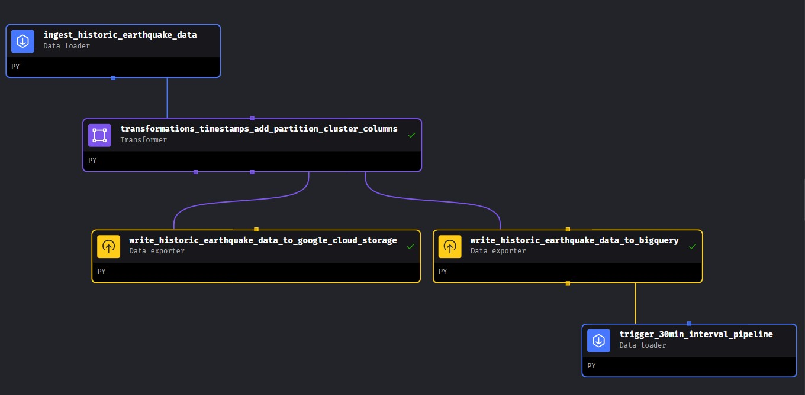
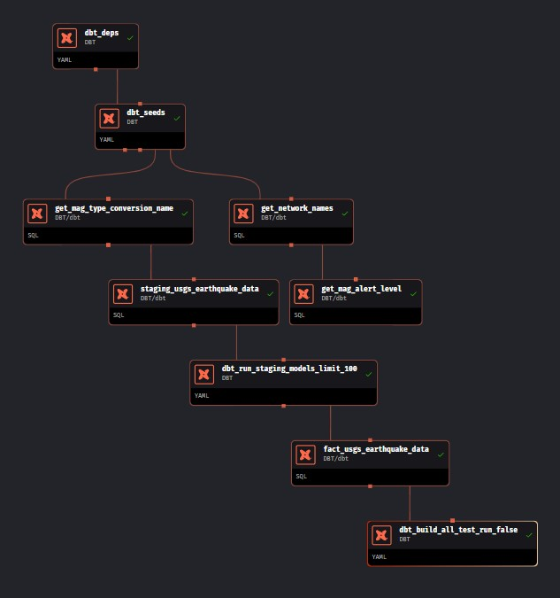
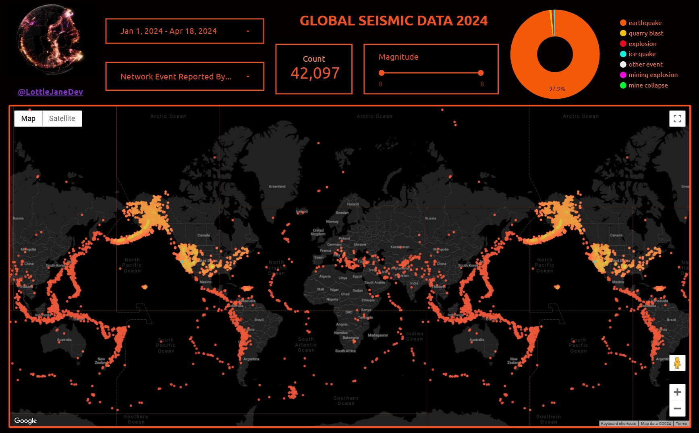

<div align="center">

# Global Earthquake Data Pipeline 

## Data Engineering Zoom Camp | 2024 Cohort | Capstone Project 

_Author | Lottie Jane Pollard_

-----------------------

[](https://www.linkedin.com/in/lottiejanedev/)
[](https://datatalks-club.slack.com/team/U04N9NTKM4K)

---------------------------


[](https://www.gnu.org/software/bash/ "Go to Bash homepage")


------------

**IMPORTANT;** _to skip the project overview & head staight to set up, click [here.](setup.md) Do not clone the repository locally, the setup will guide you & clone the repository automatically._


------------

## Table of Contents: * UPDATE THIS ONCE IT'S FINISHED *

<p align="center">
  <a href="#introduction">Introduction</a> •
  <a href="#applied-tools--technologies">Applied Tools & Technologies</a> •
  <a href="#repository-inventory">Repository Inventory</a> •
  <a href="#data-sources--schema">Data Sources & Schema</a> •
  <a href="#medallion-architecture">Medallion Architecture</a> •
  <a href="#contributing--support">Contributing & Support</a> •
  <a href="#acknowledgement--credits">Acknowledgement & Credits</a>
</p>


------------------------

</div>

<div align="center">

## _Project Overview_

The project leverages data from the U.S. Geological Survey (USGS), the science arm of the Department of the Interior, providing essential earth, water, biological, and mapping data for environmental, resource, and public safety decision-making. Established by Congress in 1879, the USGS continuously evolves its scientific endeavors to meet societal needs.

Aligned with its mission, the USGS offers an Application Programming Interface (API) for accessing earthquake data, including recent events, free of charge. For specifics on data update frequency, refer to the relevant page on the USGS website.

### _Problem Statement_

Efficiently collecting, processing, and disseminating critical earthquake information is imperative due to global seismic activity's varying magnitudes and frequencies. There's a pressing need to streamline earthquake data management for timely analysis, decision-making, and response efforts.

### _Solution_

Developing a pipeline and dashboard for earthquake data addresses this need, facilitating streamlined data acquisition, preprocessing, analysis, and visualization. A user-friendly dashboard interface allows stakeholders, including seismologists, emergency responders, policymakers, and the public, to access accurate insights into seismic events and their potential impacts. This system enhances situational awareness, empowering proactive measures for mitigating risks and ensuring community safety and resilience against earthquakes.

______________________________________________

### _Applied Tools & Technologies_

Containerisation: [Docker](https://www.docker.com/)

Workflow Orchestration: [Mage](https://www.mage.ai/)

Data Transformations: [DBT DataBuildTools](https://www.getdbt.com/)

Compute Engine: [Google Cloud Virtual Machine](https://cloud.google.com/products/compute?hl=en)

Data Lake: [Google Cloud Storage](https://cloud.google.com/storage/?hl=en)

Data Warehouse: [Google BigQuery](https://cloud.google.com/bigquery?hl=en)

Infrastructure as Code (IaC): [Terraform](https://www.terraform.io/) 

Visualisation: [Looker Studio](https://lookerstudio.google.com/)


------------------------
<div align="center">

### _Architecture Diagram_


______________________________________________

<div>

### _Repository Inventory_

The repository directory structure is as follows:

<div align="left">

```
├── usgs_earthquake_data_pipeline
│   ├── bigquery/
│   ├── data/
│   ├── images/
│   ├── mage/
│   │   ├── .gcp/
│   │   ├── csv/
│       ├── mage-usgs-project/
│       │   │   ├── data_exporters/
│       │   │   ├── data_loaders/
│       │   │   ├── dbts/
│       │       ├── pipelines/
│       │   ├── charts/
│       │   ├── custom/
│       │   ├── data_exporters/
│       │   ├── data_loaders/
│       │   ├── dbt/
│       │       ├── usgs_earthquake_data/
│       │       │   ├── analyses/
│       │       │   ├── macros/
│       │       │   ├── models/
│       │       │   │   ├── core/
│       │       │       ├── staging/
│       │       │   ├── seeds/
│       │       │   ├── snapshots/
│       │           ├── tests/
│   ├── project_criteria/
│   ├── scripts/
│   ├── setup/
    ├── terraform/
```

<div>

------------------------

### _Data | Sources, Layers & Schema_

The data used in the project is taken from the [United States Geological Survey's](https://www.usgs.gov/) web hosted [Public REST API](https://earthquake.usgs.gov/fdsnws/event/1/). 

>***! IMPORTANT - Seismologists use UTC to avoid confusion caused by local time zones and daylight savings time.***

You will find further details on the datatypes & comprehensive descriptions [here](https://earthquake.usgs.gov/data/comcat/index.php) & in the dbt model schema here *LINK TO SCHEMA YAML*: 

Dimensional Models - Data for the additional dimensions of the project were taken from the following pages [Magnitude Description (Richter Scale)](https://en.wikipedia.org/wiki/Richter_scale) & [Magnitude Types](https://www.usgs.gov/programs/earthquake-hazards/magnitude-types)

______________________________________________

### *Medallion Architecture*


[Medallion architecture](https://www.databricks.com/glossary/medallion-architecture) in data engineering refers to a modular approach where independent components, or "medallions," are interconnected to facilitate flexible and scalable data processing pipelines using the naming convention; Bronze, Silver & Gold Layers. 
______________________________________________

**Bronze Layer** 🥉

Initial Incoming Data, one minor transformation is carried out on the data prior to hitting GCS Bucket (converting `string` dates > `timestamp` dates). Data is stored in the Data Lake in it's raw, unaltered form as parquet files per date. The table structures in this layer correspond to the source system table structures "as-is," The focus in this layer is quick Change Data Capture and the ability to provide a historical archive of source (cold storage), data lineage, auditability, reprocessing if needed without rereading the data from the source system. The raw data is written to BigQuery (with restricted access) to allow for querying at this level if required. 

| _Column_      | _Data Type_ | _Description_     |
| :---        |    :----:   |          :--- |
| time      | timestamp       | time when the event occurced in milliseconds. We indicate the date and time when the earthquake initiates rupture, which is known as the "origin" time.|
| latitude   | float64        | decimal degrees latitude. Negative values for southern latitudes.      |
| longitude      | float64       | decimal degrees longitude. Negative values for western longitudes.   |
| depth   | float64        | depth of the event in kilometers.      |
| mag      | float64       | magnitude for the event.    |
| magType   | object        | method or algorithm used to calculate the preferred magnitude for the event.      |
| nst      | float64       | total number of seismic stations used to determine earthquake location  |
| gap   | float64        | largest azimuthal gap between azimuthally adjacent stations (in degrees).      |
| dmin      | float64       | horizontal distance from the epicenter to the nearest station (in degrees).   |
| rms   | float64        | root-mean-square (RMS) travel time residual, in sec, using all weights     |
| net      | object       | ID of a data contributor. Identifies the network considered to be the preferred source of information for this event.
| id   | object        | unique identifier for the event.      |
| updated      | timestamp       | time when the event was most recently updated   |
| place   | object        | textual description of named geographic region near to the event. This may be a city name, or a Flinn-Engdahl Region name      |
| type      | object       | type of seismic event e.g. earthquake, volcano   |
| horizontalError | float64        | uncertainty of reported location of the event in kilometers.      |
| depthError   | float64        | uncertainty of reported depth of the event in kilometers.     |
| magError      | float64       | uncertainty of reported magnitude of the event. The estimated standard error of the magnitude.    |
| magNst   | float64        | total number of seismic stations used to calculate the magnitude for this earthquake.      |
| status      | object       | indicates whether the event has been reviewed by a human   |
| locationSource   | object        | network that originally authored the reported location of this event.      |
| magSource      | object       | network that originally authored the reported magnitude for this event.   |

-----------------------------

**Silver Layer** 🥈

A series of refinements and optimisations aimed at enhancing the earthquake data's structure, performance, and analytical utility. Through DBT staging models, incoming earthquake data undergoes column type casting, renaming, and datatype standardisation, ensuring consistency and compatibility across datasets. Additionally, this layer implements partitioning and clustering strategies within BigQuery, optimising data organisation for efficient querying and analysis, thereby reducing latency and improving overall processing speeds. This layer incorporates the enrichment of the data through the integration of additional contextual information sourced & CSV files created, thus enabling dimensional modelling to augment analytical depth and granularity. By integrating these processes we streamline data preparation tasks & lay the groundwork for advanced analytics and reporting. By adopting partitioning, clustering, and dimensional modelling techniques, the Silver Layer optimises data storage efficiency and query performance while maintaining data integrity and facilitating future scalability.

**Gold Layer** 🥇

Focusing on enriching the dataset with additional derived columns and establishing a unified, comprehensive source of truth through the cohesion of the the staging models & dimensional tables. The data transformation process provides supplementary columns generated existing data, enabling deeper analysis and interpretation of seismic events. This culminates in the creation of a central fact table, synthesising essential metrics and relationships derived from the dimensional data. The establishment of the single source of truth (fact table) streamlines data access and reduces redundancy, promoting efficiency and agility in generating actionable insights. The Gold Layer facilitates the creation of a robust foundation for the final dashboard, enabling stakeholders to glean valuable insights and make informed decisions to mitigate risks and improve disaster response strategies.

*ADD HERE THAT DBT DOCS IS SERVED EVERY RUN AND LINK TO WHERE catalog.json IS SAVED* 

*INSERT THE FINAL SCHEMA HERE*

----------------------------------------------

### _Terraform (Infrastructure as Code (Iac))_


In this project, whilst it is indeed possible to provision a Google Cloud Platform (GCP) virtual machine (VM) using Terraform Infrastructure as Code (IaC), we have opted not to utilise this approach. There are two main reasons for this decision. Firstly, employing Terraform locally would necessitate its installation outside of the virtual environment (locally) we've established using. Secondly, even if Terraform were locally installed, the provisioning process of a virtual machine takes longer in comparrison to manually creating the VM instance following the provided instructions in the GCP Console. However, should you wish to explore Infrastructure as Code (IaC) in the future, here is a [link to the Terraform Registry Templace for a GCP VM](https://registry.terraform.io/providers/hashicorp/google/latest/docs/resources/compute_instance_template), I have provided a [virtual machine provisioning script](scripts/virtual_machine.tf). Embracing IaC and version controlling infrastructure provided multiple benefits such as enhanced consistency, reproducibility, and scalability across dev teams working on a large project. These services are important to maintain cohesion and efficiency across collaborative development projects. 

Terraform is a popular Infrastructure as Code (IaC) tool used for automating the deployment and management of cloud infrastructure. In our project, Terraform is utilized to provision resources on Google Cloud Platform (GCP).

Firstly, the Terraform configuration begins with defining the provider, which in our case is Google Cloud Platform. This section specifies essential details such as the project and region. Next, we enable required APIs for our project using the "google_project_service" resource. This ensures that necessary GCP services, such as Google Cloud Storage and BigQuery, are enabled for our project.

Following that, we define a Google Cloud Storage bucket using the "google_storage_bucket" resource. This bucket serves as a data lake for storing various types of data securely. We configure features such as versioning and lifecycle rules to manage data effectively. Additionally, we provision a BigQuery dataset using the "google_bigquery_dataset" resource. This dataset acts as a data warehouse for storing and querying structured data. We specify parameters like location, description, and default expiration settings for tables and partitions.

To handle dependencies between resources, we employ the "depends_on" attribute. This ensures that resource creation follows a specific order, ensuring that all prerequisites are met. In our Terraform script, we include provisioners to execute additional commands during resource creation. For example, we incorporate a local-exec provisioner to introduce a delay before creating the BigQuery dataset. This delay allows time for the enabled APIs to propagate effectively.

Finally, we encapsulate our Terraform commands within a bash script for streamlined execution. This script initialises Terraform, validates the configuration, plans and applies changes, and optionally destroys resources if needed. By leveraging Terraform in our project, we achieve infrastructure automation, consistency, and scalability on Google Cloud Platform.

-----------------------------

### _Mage Orchestration_ **EDIT THIS SECTION** 


There are two pipelines in Mage; `"usgs_ingest_historic"` & `"usgs_30_min_intervals"`

### Pipeline One | "usgs_earthquake_data_ingest_historic"

`"usgs_earthquake_data_ingest_historic"` - is set to trigger upon starting the project (see note below) to ingest the previous 30 days of data to initially populate your dataset. This pipeline will create your BigQuery table, within the BigQuery Dataset you provisioned earlier through Terraform & save the parquet files to your Google Cloud Storage Bucket. 

>Note; speaking with Mage directly via their Slack channel, an initial 'trigger once' that is set in the past (at the time of me creating this project) will run for you when you start the project as the logic is **_'if now is greater than start date, run'_** & there is a check box for **_'Create initial pipeline run if start date is before current execution period'_**, I have a 'trigger once' saved in code (`triggers.yaml`) & I've been assured that the initial pipeline will run when you start the project. However... should this not happen, you will need to go to the Mage UI at local host 6789, from the left menu, click on 'triggers', click on 'initial_project_trigger' & click 'Run@Once' button.

<details>
<summary>further details on initial trigger...</summary>
<br>

<br>

<br>
</details>
<br>

>🌟PIPELINE EXTENSION TASK🌟 | For an extra challenge!! Within the first pipeline block for there is the option to adjust the dates & get data as far back as you want to propagate your dataset! (Only as far as 1st January 2024 unless you disable the unit tests within the rest of the pipeline). See if you can use the `start_time` & `end_time` parameters to fill your dataset with data for the complete year! Don't forget the initial trigger above.. so you may need to to de-deduplicate data if you choose this extra task! 😄

>Note; _This pipeline can be manually ammended to set a start date & end date of your choosing. You can propagate your dataset as wide as you wish, the only limitations here are 20,000 rows per API Call, but no daily limitation on API calls. Please note; if you run this pipeline irresponsibly you may incur duplicate data. See the SQL file [here](bigquery/BiQuery_SQL_Queries.sql) for deduplication query should you accidentally run into this problem._

> Alternatively, I have set my Google Cloud Storage bucket to public [here](https://storage.googleapis.com/my_bucket/data.csv) you can read this into your BigQuery table using a `SQL Query` tab if you wish to.



-----------------------------

### Pipeline Two | "usgs_earthquake_data_30min_intervals"

`"usgs_earthquake_data_30min_intervals"` - this pipeline is triggered automatically when the above finishes using a 'sensor' block. It runs on a 30 minute trigger that can be changed to more/less frequent if desired via the 'Triggers' section of the Mage UI. It averages around 6 earthquakes every run, which isn't a large amount of data but I wanted the dashboard to be as up-to-date as possible. The difference between the code for both pipelines is minimal but significant. This pipeline will check if a parquet file exists for the current date & appends the rows to it as it has to do this every 30 minutes. This pipeline is also where the DBT integration comes into play, where you'll find the staging, dimensional & fact models alongside the Mage blocks. 


-----------------------------

### _Partitioning & Clustering_ **EDIT THIS SECTION**


Data partitioned using pyarrow before being written to GCS Bucket. Data is partitoned and clustered before being written to bigquery etc.... 
The data is partitioned & clustered in DBT before CI/CD into the Gold Layer BigQuery Data Warehouse - Do we need to set up git for DBT for CI/CD??? or does DBT update the fact table every time the pipeline runs??? 

------------------------

### _Transformations & DBT_  **EDIT THIS SECTION**

List data transformation stages 

discuss duplicates -

The data sometimes has duplicates from the sensor stations in the fact that it is the same event updated at different times, although rare, it's the same earthquake - make PK - time, lat, long, updated. A manual run of the pipeline will create duplicates - need to add a failsafe here. See SQL file for data warehouse queries should they be needed

DBT Transformations - DBT took the raw data from BigQuery native table (`usgs_2024_raw_data`) and performed transformations using [SQL Window Functions](https://www.geeksforgeeks.org/window-functions-in-sql/). The raw table is partitioned by `data_partition` and clustered by `mag_cluster`, `net` & `locationSource`



-----------------------------

### _Testing_ **EDIT THIS SECTION**


Overall, the comprehensive testing approach adopted in this project aims to minimise errors, detect issues early in the development process, and maintain the reliability and accuracy of the data processing pipeline. A robust testing strategy has been implemented to ensure the reliability, accuracy, and integrity of the data processing pipeline. The testing framework encompasses various aspects, including unit tests, integration tests, and data validation checks. Unit tests are used to verify the functionality of individual components, such as data loaders, transformers, and exporters. These tests validate specific functionalities and edge cases, ensuring that each component performs as expected.

Integration tests are employed to validate the interactions between different modules and external systems. For instance, integration tests are conducted to verify data export functions to external data warehouses, such as BigQuery. These tests validate the end-to-end functionality of the data pipeline, from data ingestion to export, ensuring seamless data flow and integration with external services.

DBT: ADD IN MORE HERE ABOUT THE DBT MODELS 

Data validation tests are performed to ensure the quality and correctness of the processed data. These tests include checks for data consistency, completeness, and adherence to predefined schemas. For example, data validation tests may verify that exported data meets certain quality standards, such as correct formatting, presence of required fields, and absence of anomalies.

-----------------------

### _Dashboard &  Visualision_ 

 

A dashboard has been developed using Google Looker Studio to visualise earthquake events. Utilising Google's native visualisation tool from within BigQuery, the dashboard benefits from enhanced speed and reduced latency. This synergy between Looker and BigQuery allows for efficient data retrieval and processing, leading to faster insights and smoother user experiences.

[Check out the interactive Dashboard here!!!](https://lookerstudio.google.com/reporting/b0be0518-3803-4301-9829-0125d48be9df)



VIDEO OF THE DASHBOARD IN ACTION HERE 

You can, of course, use the data to create your own dashboard in your preferred visualisation tool if you wish. 

-----------------------------

### _Further Ideas & Next Steps_ 

**EDIT THIS SECTION**

<div align="center">
  <p style="text-align: center; width: 100%;">
In the next phase of project development, several key ideas have been identified for implementation. These include collecting a comprehensive dataset for the year 2024 with the aim of uploading it to Kaggle for wider utilization by the data science community. Additionally, there is a plan to organize the Terraform Infrastructure as Code (IaC) into distinct environments - Development, Staging, and Production - to enhance deployment efficiency and management, along with deploying the code to Google Cloud Platform as an app using DataProc & Cloud Run. Another important aspect is the implementation of an email alert system to notify relevant stakeholders of significant earthquakes, thereby enhancing the platform's responsiveness to critical events, with the potential investigation to rebuild the project as a streaming pipeline. Utilizing Dataproc to process population data using PySpark and store it simultaneously into both BigQuery and Google Cloud Storage (GCS) buckets is also on the agenda, with the aim of optimizing data processing workflows for scalability and efficiency. Conducting tests using DBT (Data Build Tool) to ensure data quality and integrity throughout the pipeline is essential. Implementation of failsafe mechanisms to prevent data duplication when rerunning historical pipelines needs to be implemented, as well as safeguarding against unintended data loss or corruption. Additionally, integrating the dlt (Data Load Tools) library to enhance data management capabilities, utilizing features such as a paginator to ingest data, the handy inbuilt auto-schema inference, and potentially their serverless DuckDB integration, is a priority. Finally, incorporating a population data layer into the dashboard, using potential data sources such as the World Population Review and datasets available on Kaggle, will be pursued to enrich the platform with valuable insights. 

Adding the VM script to terraform

Change DBT code to work in this way - Incremental - Materialised as a table within the physical storage, but every time we DBT run there are TWO WAYS of running it 1. Drop & Create with the SELECT statement 2. or we can INSERT only new data into the table. Incremental materialisations are a powerful feature of dbt that allow for efficient updates to existing tables, reducing the need for full data refreshes 
  </p>
</div>

-----------------------------

### _Licensing_  
<a href = 'https://creativecommons.org/licenses/by-nc-sa/4.0/' target="_blank">
    
</a>

This license allows reusers to distribute, remix, adapt, and build upon the material in any medium or format for noncommercial purposes only, and only so long as attribution is given to the creator. If you remix, adapt, or build upon the material, you must license the modified material under identical terms.

-----------------------------

### _Contributing & Support_

If you're interested in contributing to this project, need to report issues or submit pull requests, please get in touch via GitHub [@lpollard-tm](https://github.com/lpollard-tm)

----------------------

### _Acknowledgements & Credits_

Acknowledgement to [DataTalksClub](https://datatalks.club/)! for mentoring us through the Data Engineering Zoom Camp over the last 10 weeks. It has been a privilege to take part in the Spring '24 Cohort, go and check them out!
 
> "DataTalks.Club - the place to talk about data! We are a community of people who are passionate about data. Join us to talk about everything related to data, to learn more about applied machine learning with our free courses and materials, to discuss the engineering aspects of data science and analytics, to chat about career options and learn tips and tricks for the job interviews, to discover new things and have fun! Our weekly events include:  👨🏼‍💻 Free courses and weekly study groups where you can start practicing within a friendly community of learners, 🔧 Workshops where you can get hands-on tutorials about technical topics, ⚙️ Open-Source Spotlight, where you can discover open-source tools with a short demo video, 🎙 Live Podcasts with practitioners where they share their experience (and the recordings too), 📺 Webinars with slides, where we discuss technical aspects of data science"

------------------------

[](https://www.linkedin.com/company/datatalks-club/)

---------------------------
