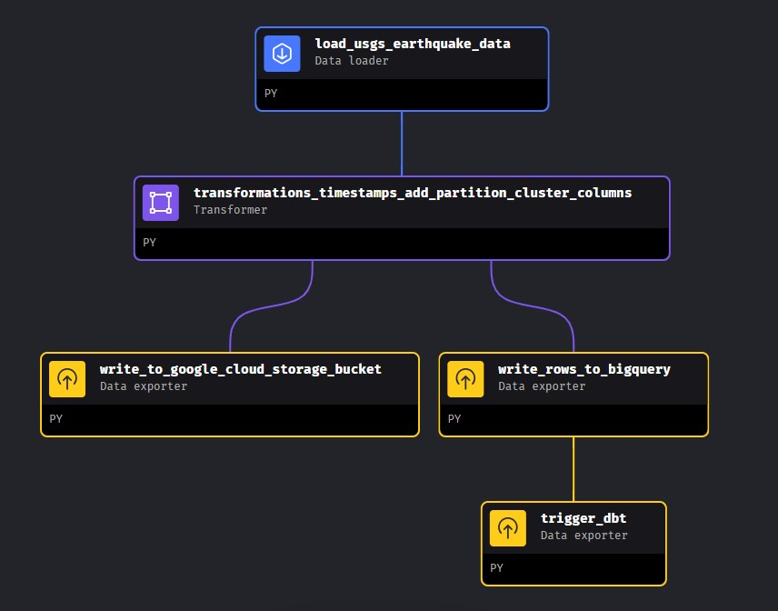

<div align="center">

# Global Earthquake Data Pipeline 

## Data Engineering Zoom Camp | 2024 Cohort | Capstone Project 

_**Author | Lottie Jane Pollard**_

-----------------------

[](https://www.linkedin.com/in/lottiejanedev/)
[](https://datatalks-club.slack.com/team/U04N9NTKM4K)

---------------------------


[](https://www.gnu.org/software/bash/ "Go to Bash homepage")


**IMPORTANT;** _to skip the project overview & head straight to set up, click [here.](setup.md) Do not clone the repository locally, the setup will guide you & clone the repository automatically._

## Table of Contents

<p align="center">
  <a href="#project-overview">Project Overview</a> • 
  <a href="#problem-statement">Problem Statement</a> • 
  <a href="#solution">Solution</a> • 
  <a href="#applied-tools--technologies">Applied Tools & Technologies</a> •
  <a href="#architecture-diagram">Architecture Diagram</a> • 
  <a href="#repository-inventory">Repository Inventory</a> •
  <a href="#project-data">Project Data</a> •
  <a href="#medallion-architecture">Medallion Architecture</a> • 
  <a href="#terraform-infrastructure-as-code">Terraform Infrastructure as Code</a> •
  <a href="#mage-orchestration">Mage Orchestration</a> •
  <a href="#partitions--clusters">Partitions & Clusters</a> •
  <a href="#Transformations--Data-Build-Tools">Transformations & Data Build Tools</a> •
  <a href="#testing">Testing</a> •
  <a href="#dashboard--visualisation">Dashboard & Visualisation</a> •
  <a href="#further-ideas--next-steps">Further Ideas & Next Steps</a> •
  <a href="#licensing">Licensing</a> •
  <a href="#contributing--support">Contributing & Support</a> •
  <a href="#acknowledgements--credits">Acknowledgements & Credits</a>
</p>


</div>

<div align="center">

## _Project Overview_

The project leverages data from the U.S. Geological Survey (USGS), the science arm of the Department of the Interior, providing essential earth, water, biological, and mapping data for environmental, resource, and public safety decision-making. Established by Congress in 1879, the USGS continuously evolves its scientific endeavors to meet societal needs.

Aligned with its mission, the USGS offers an Application Programming Interface (API) for accessing earthquake data, including recent events, free of charge. For specifics on data update frequency, refer to the relevant page on the USGS website.

### _Problem Statement_

Efficiently collecting, processing, and disseminating critical earthquake information is imperative due to global seismic activity's varying magnitudes and frequencies. There's a pressing need to streamline earthquake data management for timely analysis, decision-making, and response efforts.

### _Solution_

Developing a pipeline and dashboard for earthquake data addresses this need, facilitating streamlined data acquisition, preprocessing, analysis, and visualization. A user-friendly dashboard interface allows stakeholders, including seismologists, emergency responders, policymakers, and the public, to access accurate insights into seismic events and their potential impacts. This system enhances situational awareness, empowering proactive measures for mitigating risks and ensuring community safety and resilience against earthquakes.

______________________________________________

### _Applied Tools & Technologies_

Containerisation: <a href="https://www.docker.com/">Docker</a><br>
Workflow Orchestration: <a href="https://www.mage.ai/">Mage</a><br>
Data Transformations: <a href="https://www.getdbt.com/">DBT DataBuildTools</a><br>
Compute Engine: <a href="https://cloud.google.com/products/compute?hl=en">Google Cloud Virtual Machine</a><br>
Data Lake: <a href="https://cloud.google.com/storage/?hl=en">Google Cloud Storage</a><br>
Data Warehouse: <a href="https://cloud.google.com/bigquery?hl=en">Google BigQuery</a><br>
Infrastructure as Code (IaC): <a href="https://www.terraform.io/">Terraform</a><br>
Visualisation: <a href="https://lookerstudio.google.com/">Looker Studio</a><br>


------------------------
<div align="center">

### _Architecture Diagram_


______________________________________________

<div>

### _Repository Inventory_

The repository directory structure is as follows:

<div align="left">

```
├── usgs_earthquake_data_pipeline
│   ├── bigquery/
│   ├── data/
│   ├── images/
│   ├── mage/
│   │   ├── .gcp/
│   │   ├── csv/
│       ├── mage-usgs-project/
│       │   │   ├── data_exporters/
│       │   │   ├── data_loaders/
│       │   │   ├── dbts/
│       │       ├── pipelines/
│       │   ├── charts/
│       │   ├── custom/
│       │   ├── data_exporters/
│       │   ├── data_loaders/
│       │   ├── dbt/
│       │       ├── usgs_earthquake_data/
│       │       │   ├── analyses/
│       │       │   ├── macros/
│       │       │   ├── models/
│       │       │   │   ├── core/
│       │       │       ├── staging/
│       │       │   ├── seeds/
│       │       │   ├── snapshots/
│       │           ├── tests/
│   ├── project_criteria/
│   ├── scripts/
│   ├── setup/
    ├── terraform/
```

<div>

------------------------
<div align="center">

### _Project Data_

The data used in the project is taken from the [United States Geological Survey's](https://www.usgs.gov/) web hosted [Public REST API](https://earthquake.usgs.gov/fdsnws/event/1/). 

>***! IMPORTANT - Seismologists use UTC to avoid confusion caused by local time zones and daylight savings time.***

You will find further details on the data types & comprehensive descriptions [here](https://earthquake.usgs.gov/data/comcat/index.php) & in the [dbt model schema here](mage/mage-usgs-project/dbt/usgs_earthquake_data/models/staging/schema.yml). 

Dimensional Models - Data for the additional dimensions of the project were taken from the following pages [Magnitude Description (Richter Scale)](https://en.wikipedia.org/wiki/Richter_scale), [Magnitude Types](https://www.usgs.gov/programs/earthquake-hazards/magnitude-types) & [Network Codes](https://www.fdsn.org/networks/?search=ak).

______________________________________________

### *Medallion Architecture*


[Medallion architecture](https://www.databricks.com/glossary/medallion-architecture) in data engineering refers to a modular approach where independent components, or "medallions," are interconnected to facilitate flexible and scalable data processing pipelines using the naming convention; Bronze, Silver & Gold Layers. 
______________________________________________

**Bronze Layer** 🥉

Initial Incoming Data, one minor transformation is carried out on the data prior to hitting GCS Bucket (converting `string` dates > `timestamp` dates). Data is stored in the Data Lake in it's raw, unaltered form as parquet files per date. The table structures in this layer correspond to the source system table structures "as-is," The focus in this layer is quick Change Data Capture and the ability to provide a historical archive of source (cold storage), data lineage, audit-ability, reprocessing if needed without rereading the data from the source system. The raw data is written to BigQuery (with restricted access) to allow for querying at this level if required. 

| Column Name          | Data Type | Description                                                                                                                                                                         |
|----------------------|-----------|-------------------------------------------------------------------------------------------------------------------------------------------------------------------------------------|
| time                 | timestamp | Time when the event occurred in milliseconds. We indicate the date and time when the earthquake initiates rupture, known as the "origin" time.                                     |
| latitude             | float64   | Decimal degrees latitude. Negative values for southern latitudes.                                                                                                                   |
| longitude            | float64   | Decimal degrees longitude. Negative values for western longitudes.                                                                                                                  |
| depth                | float64   | Depth of the event in kilometers.                                                                                                                                                  |
| mag                  | float64   | Magnitude for the event.                                                                                                                                                           |
| magType              | object    | Method or algorithm used to calculate the preferred magnitude for the event.                                                                                                       |
| nst                  | float64   | Total number of seismic stations used to determine earthquake location.                                                                                                             |
| gap                  | float64   | Largest azimuthal gap between azimuthally adjacent stations (in degrees).                                                                                                           |
| dmin                 | float64   | Horizontal distance from the epicenter to the nearest station (in degrees).                                                                                                         |
| rms                  | float64   | Root-mean-square (RMS) travel time residual, in seconds, using all weights.                                                                                                         |
| net                  | object    | ID of a data contributor. Identifies the network considered to be the preferred source of information for this event.                                                               |
| id                   | object    | Unique identifier for the event.                                                                                                                                                   |
| updated              | timestamp | Time when the event was most recently updated.                                                                                                                                     |
| place                | object    | Textual description of named geographic region near to the event. This may be a city name, or a Flinn-Engdahl Region name.                                                          |
| type                 | object    | Type of seismic event, e.g., earthquake, volcano.                                                                                                                                  |
| horizontalError      | float64   | Uncertainty of reported location of the event in kilometers.                                                                                                                        |
| depthError           | float64   | Uncertainty of reported depth of the event in kilometers.                                                                                                                          |
| magError             | float64   | Uncertainty of reported magnitude of the event. The estimated standard error of the magnitude.                                                                                     |
| magNst               | float64   | Total number of seismic stations used to calculate the magnitude for this earthquake.                                                                                              |
| status               | object    | Indicates whether the event has been reviewed by a human.                                                                                                                          |
| locationSource       | object    | Network that originally authored the reported location of this event.                                                                                                               |
| magSource            | object    | Network that originally authored the reported magnitude for this event.                                                                            

-----------------------------
-----------------------------

**Silver Layer** 🥈

A series of refinements and optimisations aimed at enhancing the earthquake data's structure, performance, and analytical utility. Through DBT staging models, incoming earthquake data undergoes column type casting, renaming, and datatype standardisation, ensuring consistency and compatibility across datasets. Additionally, this layer implements partitioning and clustering strategies within BigQuery, optimising data organisation for efficient querying and analysis, thereby reducing latency and improving overall processing speeds. This layer incorporates the enrichment of the data through the integration of additional contextual information sourced & CSV files created, thus enabling dimensional modelling to augment analytical depth and granularity. By integrating these processes we streamline data preparation tasks & lay the groundwork for advanced analytics and reporting. By adopting partitioning, clustering, and dimensional modelling techniques, the Silver Layer optimises data storage efficiency and query performance while maintaining data integrity and facilitating future scalability.

---------------------------

**Gold Layer** 🥇

Focusing on enriching the dataset with additional derived columns and establishing a unified, comprehensive source of truth through the cohesion of the the staging models & dimensional tables. The data transformation process provides supplementary columns generated by existing data, enabling deeper analysis and interpretation of seismic events. This culminates in the creation of a central fact table, synthesising essential metrics and relationships derived from the dimensional data. The establishment of the single source of truth (fact table) streamlines data access and reduces redundancy, promoting efficiency and agility in generating actionable insights. The Gold Layer facilitates the creation of a robust foundation for the final dashboard, enabling stakeholders to glean valuable insights and make informed decisions to mitigate risks and improve disaster response strategies. 

**Final dataset schema:** 

| Column Name                     | Data Type | Description                                                                                                                                                                         |
|--------------------------------|-----------|-------------------------------------------------------------------------------------------------------------------------------------------------------------------------------------|
| unique_event_id                | string    | Unique identifier for each event                                                                                                                                                   |
| event_id                       | string    | Identifier for the event                                                                                                                                                            |
| event_datetime                 | timestamp | Date and time of the event                                                                                                                                                         |
| event_date                     | date      | Date of the event                                                                                                                                                                   |
| event_time                     | time      | Time of the event                                                                                                                                                                   |
| descriptive_geographic_region  | string    | Descriptive geographic region of the event                                                                                                                                         |
| event_type                     | string    | Type of the event                                                                                                                                                                   |
| event_latitude                 | float64   | Latitude of the event location                                                                                                                                                      |
| event_longitude                | float64   | Longitude of the event location                                                                                                                                                     |
| depth_km                       | numeric   | Depth of the event in kilometers                                                                                                                                                    |
| last_updated                   | timestamp | Timestamp indicating when the data was last updated                                                                                                                                 |
| event_review_status            | string    | Review status of the event                                                                                                                                                          |
| event_magnitude                | numeric   | Magnitude of the event                                                                                                                                                              |
| magnitude_alert_level          | string    | Magnitude alert level                                                                                                                                                               |
| magnitude_conversion_type      | string    | Type of magnitude conversion                                                                                                                                                        |
| magnitude_type_method          | string    | Method of magnitude type                                                                                                                                                            |
| no_stations_to_calculate_location | numeric | Number of stations used to calculate the event location                                                                                                                            |
| largest_gap_between_stations   | numeric   | Largest gap between stations                                                                                                                                                        |
| dist_epicenter_to_station_degrees | numeric | Distance from the epicenter to the station in degrees                                                                                                                               |
| root_mean_square_residual_seconds | numeric | Root mean square residual in seconds                                                                                                                                                |
| horizontal_location_error_km   | numeric   | Horizontal location error in kilometers                                                                                                                                             |
| depth_uncertainty_km           | numeric   | Depth uncertainty in kilometers                                                                                                                                                    |
| magnitude_uncertainty          | numeric   | Magnitude uncertainty                                                                                                                                                               |
| no_stations_to_calculate_magnitude | numeric | Number of stations used to calculate the magnitude                                                                                                                                  |
| data_contributor_network_id    | string    | Identifier of the data contributor network                                                                                                                                          |
| data_contributor_network_name  | string    | Name of the data contributor network                                                                                                                                                |
| network_reported_by_id         | string    | Identifier of the network reported by                                                                                                                                              |
| network_reported_by_name       | string    | Name of the network reported by                                                                                                                                                     |
| network_magnitude_author_id    | string    | Identifier of the network magnitude author                                                                                                                                          |
| network_magnitude_author_name  | string    | Name of the network magnitude author                                                                                                                                                |


----------------------------------------------

### _Terraform Infrastructure as Code_


In this project, whilst it is indeed possible to provision a Google Cloud Platform (GCP) virtual machine (VM) using Terraform Infrastructure as Code (IaC), we have opted not to utilise this approach. There are two main reasons for this decision. Firstly, employing Terraform locally would necessitate its installation outside of the virtual environment (locally) we've established using. Secondly, even if Terraform were locally installed, the provisioning process of a virtual machine takes longer in comparison to manually creating the VM instance following the provided instructions in the GCP Console. However, should you wish to explore Infrastructure as Code (IaC) in the future, here is a [link to the Terraform Registry Template for a GCP VM](https://registry.terraform.io/providers/hashicorp/google/latest/docs/resources/compute_instance_template), I have provided a [virtual machine provisioning script](scripts/virtual_machine.tf). Embracing IaC and version controlling infrastructure provided multiple benefits such as enhanced consistency, reproducibility, and scalability across dev teams working on a large project. These services are important to maintain cohesion and efficiency across collaborative development projects. 

Terraform is a popular Infrastructure as Code (IaC) tool used for automating the deployment and management of cloud infrastructure. In our project, Terraform is utilized to provision resources on Google Cloud Platform (GCP).

Firstly, the Terraform configuration begins with defining the provider, which in our case is Google Cloud Platform. This section specifies essential details such as the project and region. Next, we enable required APIs for our project using the "google_project_service" resource. This ensures that necessary GCP services, such as Google Cloud Storage and BigQuery, are enabled for our project.

Following that, we define a Google Cloud Storage bucket using the "google_storage_bucket" resource. This bucket serves as a data lake for storing various types of data securely. We configure features such as versioning and lifecycle rules to manage data effectively. Additionally, we provision a BigQuery dataset using the "google_bigquery_dataset" resource. This dataset acts as a data warehouse for storing and querying structured data. We specify parameters like location, description, and default expiration settings for tables and partitions.

To handle dependencies between resources, we employ the "depends_on" attribute. This ensures that resource creation follows a specific order, ensuring that all prerequisites are met. In our Terraform script, we include provisioners to execute additional commands during resource creation. For example, we incorporate a local-exec provisioner to introduce a delay before creating the BigQuery dataset. This delay allows time for the enabled APIs to propagate effectively.

Finally, we encapsulate our Terraform commands within a bash script for streamlined execution. This script initialises Terraform, validates the configuration, plans and applies changes, and optionally destroys resources if needed. By leveraging Terraform in our project, we achieve infrastructure automation, consistency, and scalability on Google Cloud Platform.

-----------------------------

### _Mage Orchestration_


There are three pipelines in Mage; `"usgs_ingest_historic"`, `"usgs_30_min_intervals"` & `"dbt_pipeline"`

### Pipeline One | "usgs_earthquake_data_ingest_historic"

`"usgs_earthquake_data_ingest_historic"` - is set to trigger upon starting the project (see note below) to ingest the previous 30 days of data to initially populate your dataset. This pipeline will create your BigQuery table, within the BigQuery Dataset you provisioned earlier through Terraform & save the parquet files to your Google Cloud Storage Bucket. 

>**Note;** speaking with Mage directly via their Slack channel, an initial 'trigger once' that is set in the past (at the time of me creating this project) will run for you when you start the project as the logic is **_'if now is greater than start date, run'_** & there is a check box for **_'Create initial pipeline run if start date is before current execution period'_**, I have a 'trigger once' saved in code (`triggers.yaml`) & I've been assured that the initial pipeline will run when you start the project. However... should this not happen, you will need to go to the Mage UI at local host 6789, from the left menu, click on 'triggers', click on 'initial_project_trigger' & click 'Run@Once' button.


<br>

>🌟**PIPELINE EXTENSION TASK**🌟 | For an extra challenge!! Within the first pipeline block (historic_pipeline) there is the option to adjust the dates & get data as far back as you want to propagate your dataset! (Only as far as 1st January 2024 unless you disable the unit tests within the rest of the pipeline). See if you can use the `start_time` & `end_time` parameters to fill your dataset with data for the complete year! Don't forget the initial trigger above.. you may need to to de-deduplicate data if you choose this extra task! Good luck! 😄

>Note; _This pipeline can be manually amended to set a start date & end date of your choosing. You can propagate your dataset as wide as you wish, the only limitations here are 20,000 rows per API Call, but no daily limitation on API calls. Please note; if you run this pipeline irresponsibly you may incur duplicate data. See the SQL file [here](bigquery/BiQuery_SQL_Queries.sql) for deduplication query should you accidentally run into this problem._

> Alternatively, I have set my Google Cloud Storage bucket to public [here](https://console.cloud.google.com/storage/browser/usgs-raw-data/) you can read this into your BigQuery table using a `SQL Query` tab if you wish to.


-----------------------------

### Pipeline Two | "usgs_earthquake_data_30min_intervals"

`"usgs_earthquake_data_30min_intervals"` - this pipeline is triggered automatically when the above finishes using a 'sensor' block. It runs on a 30 minute trigger that can be changed to more/less frequent if desired via the 'Triggers' section of the Mage UI. It averages around 6 earthquakes every run, which isn't a large amount of data but I wanted the dashboard to be as up-to-date as possible. The difference between the code for both pipelines is minimal but significant. This pipeline will check if a parquet file exists for the current date & appends the rows to it as it has to do this every 30 minutes. This pipeline is also where the DBT integration comes into play, where you'll find the staging, dimensional & fact models alongside the Mage blocks. 



### Pipeline Three | "dbt_pipeline"

This pipeline is triggered by Pipeline Two. It acts as the Analytics Transformation layer over the top the raw dataset performing final transformations, type casting & data enrichment. The product of this pipeline is the `fact_usgs_earthquake_data` table which acts as the single source of truth & data layer that should be made available for data analysis. The DAG for this pipeline can be found below in the 'Transformations & Data Build Tools' section. 

-----------------------------

### _Partitions & Clusters_ 


Upon ingestion of the data from source, the data is partitioned into parquet files by day to allow for efficient storage & retrieval of records. See [this python data exporter](mage/mage-usgs-project/data_exporters/write_to_google_cloud_storage_bucket.py). There is a slight difference in the script for the historic pipeline & the 30 minute interval pipeline in that the 30 minute interval has to check if the file for the current day exists & if it does, append the rows to the existing parquet file. The script uses the `Pyarrow` library & Mage's in-built Google Cloud connectors to perform this action. 

Separately to this, the concurrent [data exporter](mage/mage-usgs-project/data_exporters/write_rows_to_bigquery.py) writes the data to Google BigQuery, you will see the script uses Googles `LoadJobConfig`, `TimePartitioning` & `clustering_fields` methods/parameters to write the data to a partitioned & clustered BigQuery table. The data is partitioned on `date_partition` which is a column derived from the original `time` (string type) column due to BigQuery only accepting certain data types for partitioning & the need for me to preserve the original raw data at this stage. 

The same script also clusters the data by `locationSource`, `net` & a new column created in the script `mag_cluster`. These are the columns most likely to be queried alongside the already partitioned date columns. I had to create the `mag_cluster` column as the current `mag` (relating to earthquake magnitude) column was a Float64 type (e.g. 2.87 magnitude). I needed to created 'bins' to cluster records by magnitude levels 0-1, 1-2, 2-3 etc. 

<div align="left">

```python
    bigquery_client = BigQuery.with_config(ConfigFileLoader(config_path, config_profile)).client

    job_config = LoadJobConfig(
    schema=schema,
    write_disposition='WRITE_APPEND',
    time_partitioning=TimePartitioning(
        type_=TimePartitioningType.DAY,
        field="date_partition", 
        expiration_ms=None,
    ),
    clustering_fields=["mag_cluster", "locationSource", "net"]
)
    
    job = bigquery_client.load_table_from_dataframe(df, table_id, job_config=job_config)
    result = job.result()
```
<div>

<div align="center">

------------------------

### _Transformations & Data Build Tools_

**General Transformations**

As previously mentioned, I focused on protecting the raw data at Bronze level in the initial ingestion & storage of the data. The only transformations in the initial stage are ones that were mandatory for partitioning/clustering effectively. 

Pipelines One & Two have a transformation block that converts/creates columns as per the below code block & accompanying comments. 

<div align="left">

```python
@transformer
def transform(df):
    
    # Convert 'time' column to datetime with milliseconds precision
    df['time'] = pd.to_datetime(df['time'], format='%Y-%m-%d %H:%M:%S.%f')

    # Convert 'updated' column to datetime with milliseconds precision
    df['updated'] = pd.to_datetime(df['updated'], format='%Y-%m-%d %H:%M:%S.%f')
   
    # Pre-process DataFrame to create a new column for clustering by magnitude level
    df['mag_cluster'] = pd.cut(df['mag'], 
        bins=[0, 1, 2, 3, 4, 5, 6, 7, 8, 9, 10], 
        labels=['0-1', '1-2', '2-3', '3-4', '4-5', '5-6', '6-7', '7-8', '8-9', '9-10'])

    # Create a new column for the date partition - BigQuery only except 'TIMESTAMP, DATETIME or DATE, I want to preserve the exact timestamp in milliseconds (datetime64[ns, UTC]) for analysis 
    df['date_partition'] = df['time'].dt.date
```
<div align="center">

**Missing Values & Deduplication**

After analysing the columns of null/missing values, I deemed it unnecessary or rather unquantifiable as to their relevance for analysis by a data scientist. As I was unable to determine the use the mathematical columns, I opted to leave them as they came. Further discussions should be had around the significance of these columns and how to handle missing values, it's not for me to decide what is/is not relevant to a data scientist. 

Whilst I investigated duplicate data, I found the frequency of it to be extremely low. Instances of duplication occur only when a seismic event is reported then later a change has been made to the magnitude or location for example. In these cases, we end up with two rows with the same `id` & `timestamp`. I opted to handle this duplication using DBT. In the code snippet below I have used a SQL statement to assign a row number to each record within each group defined by the combination of the id and time columns, ordered by the updated column in descending order (latest records first). Lastly the outer query filters the data to only include rows where the row number (rn) is equal to 1. Effectively, this only keeps the most recently updated record for that particular seismic event. After this a surrogate key is generated `{{ dbt_utils.generate_surrogate_key(["id", "time"]) }} as unique_event_id,`

<div align="left">

```SQL
with
    source_data_partitioned as (
        select *, row_number() over (partition by id, time order by updated desc) as rn
        from {{ source("staging", "usgs_earthquake_data_raw_2024") }}
        where time is not null
    )
    ....
    ....
from 
    source_data
where rn = 1
```

<div align="center">

As previously stated in the pipeline section; a manual run of any of the pipelines will create duplicate records of data. I have included a BigQuery SQL Query File [here](bigquery/BigQuery_SQL_Queries.sql) to assist with deduplication should you find yourself in this situation. Ths is only for the RAW data table `'usgs_earthquake_data_raw_2024'` but can be adapted to other tables if you wish. 

**DBT Transformations** 

DBT takes the raw data from the partitioned BigQuery native table (`usgs_earthquake_data_raw_2024`) and performs transformations using [SQL Window Functions](https://www.geeksforgeeks.org/window-functions-in-sql/). 

The staged schema can be found above in the 'Gold Layer' of the 'Data section' or in the [dbt model here](mage/mage-usgs-project/dbt/usgs_earthquake_data/models/staging/staging_usgs_earthquake_data.sql). This is where you'll find most of the transformations & data type casting. The staging model is in a 'view' format. The staging model also incorporates three macros to enrich the data. You'll find the .csv data for these in `seeds` & `macros`, examples below: 

<div align="left">

```SQL
    {{ get_mag_alert_level('mag') }} as magnitude_alert_level,
    {{ get_mag_type_conversion_name('magtype')}} as magnitude_conversion_type_name,
    {{ get_network_names("net") }} as data_contributor_network_name,
```
<div align="centre">

The final fact table can be found [here](mage/mage-usgs-project/dbt/usgs_earthquake_data/models/core/fact_usgs_earthquake_data.sql). This is where you'll find the final materialized 'table' in order ready for distribution to stakeholders using RBAC (Role Based Access Controls). This table is once again, partitioned & clustered as per the below code snippet. 

<div align="left">

```bash
{{ config(
    materialized='table',
    partition_by={
        "field": "event_date",
        "data_type": "date",
        "granularity": "day"
    },
    cluster_by=["event_type", "event_magnitude", "network_reported_by_name"]
)}}
```
<div>

<div align="center">

Here is the pipeline diagram for the `dbt_pipeline`. I chose to add this as a separate pipeline, although it is fully optional to integrate these blocks into your existing Mage pipeline (you could even just add one `dbt build` block to the end of your pipeline if you prefer) however, personally, I wanted to make use of the visualisation of the pipeline lineage (and incorporate all of the otherwise manual Command Line based input that wouldn't be automated) to be viewed as a whole process. 


-----------------------------

### _Testing_


Overall, the comprehensive testing approach adopted in this project aims to minimise errors, detect issues early in the development process, and maintain the reliability and accuracy of the data processing pipeline. A robust testing strategy has been implemented to ensure the reliability, accuracy, and integrity of the data processing pipeline. The testing framework encompasses various aspects, including unit tests, integration tests, and data validation checks. Unit tests are used to verify the functionality of individual components, such as data loaders, transformers, and exporters. These tests validate specific functionalities and edge cases, ensuring that each component performs as expected.

Integration tests are employed to validate the interactions between different modules and external systems. For instance, integration tests are conducted to verify data export functions to external data warehouses, such as BigQuery. These tests validate the end-to-end functionality of the data pipeline, from data ingestion to export, ensuring seamless data flow and integration with external services.

Data validation tests are performed to ensure the quality and correctness of the processed data. These tests include checks for data consistency, completeness, and adherence to predefined schemas. For example, data validation tests may verify that exported data meets certain quality standards, such as correct formatting, presence of required fields, and absence of anomalies.

Please see the pipeline blocks & testing sections for full details of tests employed in this project.  


<details>
<summary>Example test block. See full pipeline scripts for exhaustive testing framework</summary>
<br>

<div align="left">

```python
@test
class TestDataExporterToGoogleCloudStorage(unittest.TestCase):

    def setUp(self):
        # Create a sample DataFrame for testing
        self.df = pd.DataFrame({
            'time': pd.date_range(start='2023-04-01', end='2023-04-03'),
            'magnitude': [5.0, 6.2, 4.5]
        })

    @patch('mage_ai.exporter.GoogleCloudStorage.with_config')
    @patch('mage_ai.exporter.pq.write_table')
    def test_export_data_to_google_cloud_storage(self, mock_write_rows, mock_with_config):
        
        # acts as if file doesn't already exist 
        mock_exists = MagicMock(return_value=False)
        mock_with_config.return_value.exists = mock_exists

        export_data_to_google_cloud_storage(self.df)

        # Check if the Parquet file is written
        mock_write_rows.assert_called_once()

    @patch('mage_ai.exporter.GoogleCloudStorage.with_config')
    @patch('mage_ai.exporter.pq.read_table')
    @patch('mage_ai.exporter.pq.write_table')
    def test_export_data_to_google_cloud_storage_update(self, mock_write_rows, mock_read_rows, mock_with_config):
        # Mock existing table
        existing_df = pd.DataFrame({
            'time': pd.date_range(start='2024-04-01', end='2024-04-02'),
            'magnitude': [3.0, 4.5]
        })

        # returns as though a file already exists
        mock_read_rows.return_value.to_pandas.return_value = existing_df

        mock_exists = MagicMock(return_value=True)
        mock_with_config.return_value.exists = mock_exists

        export_data_to_google_cloud_storage(self.df)

        # Check if the Parquet file is updated with merged data
        mock_write_rows.assert_called_once()
```

<br>
</details>
<br>

-----------------------

### _Dashboard & Visualision_ 

 

A dashboard has been developed using Google Looker Studio to visualise seismic events. Utilising Google's native visualisation tool from within BigQuery, the dashboard benefits from enhanced speed and reduced latency. This synergy between Looker and BigQuery allows for efficient data retrieval and processing, leading to faster insights and smoother user experiences.

[Check out the interactive Dashboard here!!!](https://lookerstudio.google.com/reporting/b0be0518-3803-4301-9829-0125d48be9df)

_**Dashboard Image**_


<br>

The dashboard collates the data gathered into a visual representation that has been built with user engagement & interaction in mind. You can filter the `seismic event` from `ice quake` to `mine collapse`, filter on the event's `magnitude`, choose your time period & filter on the `seismic network station` reporting the event. The interactive map is powered by Google Maps giving every detail from street view to satellite imagery. The darker the bubble the more extreme the seismic event. 

_**Dashboard Video**_

<video width="900" height="400" controls>
  <source src="images/dashboard_video.mp4" type="video/mp4">
  Your browser does not support the video tag.
</video>

<br>
You can, of course, use the data to create your own dashboard in your preferred visualisation tool if you wish. 

-----------------------------

### _Further Ideas & Next Steps_ 

<div align="center">

I faced several issues with the project & of course, naturally came up with other ideas & things I'd like to refactor or add to for the second iteration.

<div align="left">

* Collect a comprehensive dataset of seismic event for 2024 & publish to Kaggle for wider utilisation by the data science community. 
* I had hoped to have enough time (but didn't) to incorporate a large population dataset, volcano data & even extraterrestrial sightings as extra layers over the seismic activity to show the populated areas, UFO sightings & volcanic activity & their proximity to events. 
* Deploy the project as an app to [Google Cloud Run](https://cloud.google.com/run/). I didn't deem it necessary for the project at this size/level. However, with the future development, this could be a viable use case for a fully managed serverless platform such as Google Cloud Run.  
* Leveraging Google Cloud Run would allow for the project to be a fully deployed, web hosted, containerised application with it's own API. 
* Another important aspect is the implementation of an email alert system to notify relevant stakeholders of significant earthquakes, thereby enhancing the platform's responsiveness to critical events, with the potential investigation to rebuild the project as a streaming pipeline.
* Issue with using `sftp` or `gcloud scp` to transfer files between the local host & the Virtual Machine due to company policy restrictions so had to use a screen prompt to ask the user to drag & drop their Service Account Credentials - not ideal, but I have included the other methods that can be uncommented if you don't have restrictions. 
* Organise the Terraform files into a more modular format with distinct environments (Development, Staging & Production) to enhance deployment efficiency and management
* If I'd had time to incorporate the additional layers of data I'd have liked to of used Google Data Proc's Apache Spark Cluster platform to process a larger dataset 
* Again, if time were permitting I'd have like to of incorporated the amazing `dlt library` to perhaps process paginated data with auto schema inference & the serverless DuckDB engine plugin. 
* Potentially using Regex to extra the Location data from the `place` string column or some other way of getting more location data from the coordinates, maybe using an API or reverse geocoding 
* I would have liked to incorporate more testing in the DBT phase of the project had I had more time, however, Mage & DBT are not the easiest to figure out due to lack of documentation & it not being very intuitive. The course taught us DBT Cloud / Core, so figuring out how to use DBT in-built with the orchestration tool was a challenge, but certainly worth it. 
* I'd like to somehow implement a failsafe mechanism to prevent data duplication when rerunning the pipelines manually. 
* I'd also like to incorporate incremental loading of the data into DBT. At present, DBT reads the entire table & writes it back. At circa 42,000 rows (at the time of writing) this isn't too much of an issue but is not sustainable. It's not a concept taught during the course but once I have discovered myself. However, I would need to learn this thoroughly before deciding to attempt implementation as incorrect implementation could significantly risk the datasets integrity. Incremental materialisations are a powerful feature of dbt that allow for efficient updates to existing tables, reducing the need for full data refreshes 
  </p>
</div>

-----------------------------

### _Licensing_  
<a href = 'https://creativecommons.org/licenses/by-nc-sa/4.0/' target="_blank">
    
</a>

This license allows users to distribute, remix, adapt, and build upon the material in any medium or format for noncommercial purposes only, and only so long as attribution is given to the creator. If you remix, adapt, or build upon the material, you must license the modified material under identical terms.

-----------------------------

### _Contributing & Support_

If you're interested in contributing to this project, need to report issues or submit pull requests, please get in touch via GitHub [@lpollard-tm](https://github.com/lpollard-tm) / [@LottieJaneDev](https://github.com/LottieJaneDev)

----------------------

### _Acknowledgements & Credits_

Acknowledgement to [DataTalksClub](https://datatalks.club/)! for mentoring us through the Data Engineering Zoom Camp over the last 10 weeks. It has been a privilege to take part in the Spring '24 Cohort, go and check them out!
 
> "DataTalks.Club - the place to talk about data! We are a community of people who are passionate about data. Join us to talk about everything related to data, to learn more about applied machine learning with our free courses and materials, to discuss the engineering aspects of data science and analytics, to chat about career options and learn tips and tricks for the job interviews, to discover new things and have fun! Our weekly events include:  👨🏼‍💻 Free courses and weekly study groups where you can start practicing within a friendly community of learners, 🔧 Workshops where you can get hands-on tutorials about technical topics, ⚙️ Open-Source Spotlight, where you can discover open-source tools with a short demo video, 🎙 Live Podcasts with practitioners where they share their experience (and the recordings too), 📺 Webinars with slides, where we discuss technical aspects of data science"

------------------------

[](https://www.linkedin.com/company/datatalks-club/)

---------------------------
