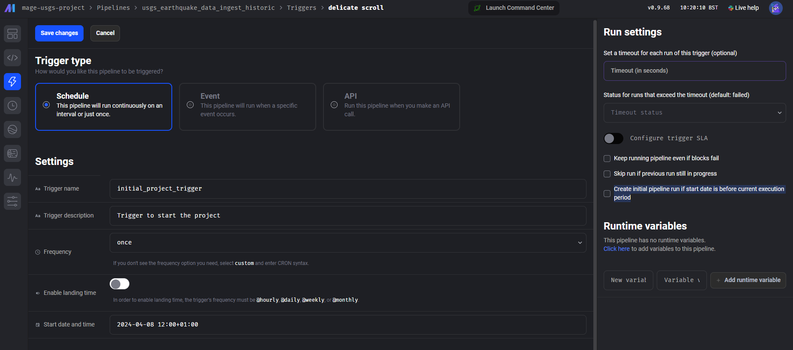
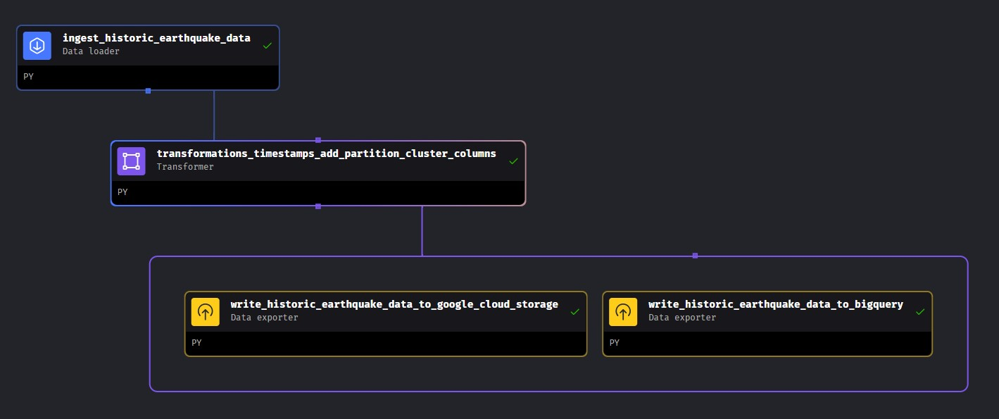
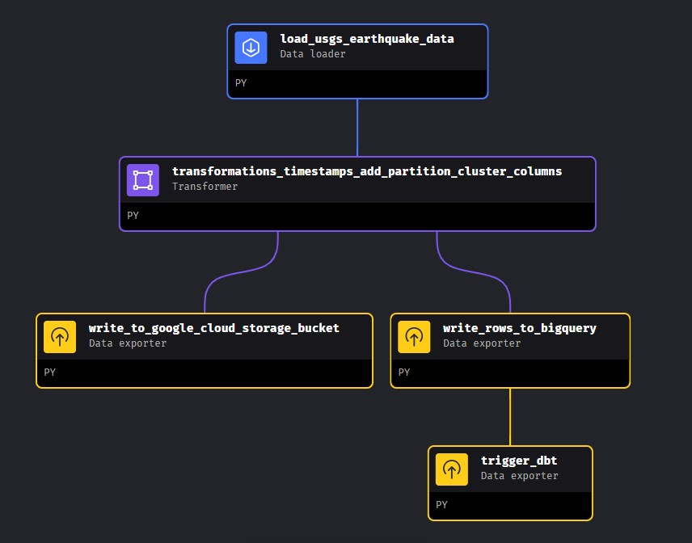
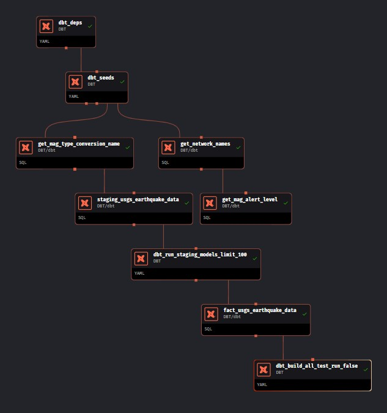

# Mage-ai | Workflow Orchestration


Mage-AI, an abbreviation for Magic-Artificial Intelligence, represents a revolutionary convergence of mystical craftsmanship and contemporary technology. Functioning as a refined platform, it harnesses the capabilities of AI algorithms within the domain of workflow orchestration. Here, workflow orchestration denotes the precise coordination and arrangement of magical procedures (pipelines) and ceremonies (triggers) to attain desired results effortlessly. Mage facilitates this intricate process by automating mundane tasks and overseeing resource allocation with precision. Its user-friendly & modern interface and adaptable nature guarantee that even inexperienced practitioners can traverse complex projects with assurance and skill.

## 🧙‍♂️ Mage Features:

- **AI Integration:** Mage incorporates artificial intelligence algorithms to analyse and interpret data, providing intelligent insights and recommendations for data-driven decision-making.

- **Workflow Automation:** It automates data processing tasks, reducing manual effort and streamlining workflows for improved efficiency and productivity.

- **Resource Allocation:** Mage optimises resource allocation within data pipelines, ensuring efficient utilisation of computing resources and minimising processing time.

- **User-Friendly Interface:** The platform offers an intuitive interface for data engineers to interact with, making it easy to configure, monitor, and manage data workflows.

- **Customisation:** Mage allows for customisation of data pipelines to suit specific project requirements, enabling data engineers to tailor workflows to their unique needs.

- **Scalability:** It is designed to scale seamlessly, handling large volumes of data without compromising performance or reliability.

- **Monitoring and Alerting:** Mage includes built-in monitoring and alerting functionalities to track the health and performance of data pipelines in real-time, ensuring timely intervention in case of issues or anomalies.

- **Data Governance:** The platform supports data governance practices by providing features for data lineage tracking, metadata management, and access control, ensuring compliance with regulations and standards.

- **Built-in Connectors:** Mage comes equipped with a wide range of connectors to various data sources and platforms, allowing seamless integration with popular databases, cloud services, and data warehouses.

- **Pre-built Code Blocks:** It offers a library of pre-built code blocks for common data engineering tasks, such as data transformation, cleansing, and enrichment. These reusable code blocks accelerate development cycles and ensure consistency across data pipelines.

- **Integrated dbt (Data Build Tool):** Mage includes built-in support for dbt, a popular data transformation tool. This integration enables data engineers to easily build, test, and deploy data transformation workflows using dbt's familiar syntax and features, all within the Mage platform.


## _Initialise Mage_

Initialise Mage by running the below code block: 

```bash
cd ~/usgs_earthquake_data_pipeline/setup/ && ./project_run.sh
```

Run the [project_run.sh](../setup/project_run.sh) shell script. This will: 

1. copy your service account keys into the project directory for Mage to access & authorise Mage to interact with the Google Cloud resources. 

2. Start the Docker container using the [`docker-compose.yaml`](../docker-compose.yaml) configurations & the subsequent Mage [`Dockerfile`](../mage/Dockerfile) to build the container image. 

3. Automatically set up [port forwarding](https://medium.com/@maheshwar.ramkrushna/chap-11-docker-port-mapping-exposing-container-services-to-the-host-system-66de32abdb2f#:~:text=Docker%20port%20mapping%2C%20also%20known,accessible%20from%20outside%20the%20container.), this is required so that you can access the port INSIDE the Docker container, from your local machine OUTSIDE of the Docker container, click to the link for more information if you're not familiar with the process. 

4. It will give you the local host link to access the Mage User Interface. `http://localhost:6789` once the port forwarding is in place. 

5. You are free to explore the pipelines and the code but you don't need to do anything for the project to run, it's automatic! Details on the pipelines can be found below. 

6. You can now view your [Google Cloud Storage Bucket](https://console.cloud.google.com/storage/) to see the parquet files have been generated & your [Google Cloud BigQuery Dataset](https://console.cloud.google.com/bigquery) to see that your Dataset now has a partitioned & clustered table containing the earthquakes events! 

7. You will also notice there's more than one table in your Dataset. This is due to the DBT (DataBuildTools) integration layer. See below "DBT (Data Build Tools) Analytics Engineering Layer" section for full information
__________________________________

## _Project Pipelines_

There are three pipelines in Mage; `"usgs_ingest_historic"`, `"usgs_30_min_intervals"` & `"dbt_pipeline"`

### Pipeline One | "usgs_earthquake_data_ingest_historic"

`"usgs_earthquake_data_ingest_historic"` - is set to trigger upon starting the project (see note below) to ingest the previous 30 days of data to initially populate your dataset. This pipeline will create your BigQuery table, within the BigQuery Dataset you provisioned earlier through Terraform & save the parquet files to your Google Cloud Storage Bucket. 

>**Note;** speaking with Mage directly via their Slack channel, an initial 'trigger once' that is set in the past (at the time of me creating this project) will run for you when you start the project as the logic is **_'if now is greater than start date, run'_** & there is a check box for **_'Create initial pipeline run if start date is before current execution period'_**, I have a 'trigger once' saved in code (`triggers.yaml`) & I've been assured that the initial pipeline will run when you start the project. However... should this not happen, you will need to go to the Mage UI at local host 6789, from the left menu, click on 'triggers', click on 'initial_project_trigger' & click 'Run@Once' button.

<br>

<br>

>🌟**PIPELINE EXTENSION TASK**🌟 | For an extra challenge!! Within the first pipeline block (historic_pipeline) there is the option to adjust the dates & get data as far back as you want to propagate your dataset! (Only as far as 1st January 2024 unless you disable the unit tests within the rest of the pipeline). See if you can use the `start_time` & `end_time` parameters to fill your dataset with data for the complete year! Don't forget the initial trigger above.. you may need to to de-deduplicate data if you choose this extra task! Good luck! 😄

>Note; _This pipeline can be manually amended to set a start date & end date of your choosing. You can propagate your dataset as wide as you wish, the only limitations here are 20,000 rows per API Call, but no daily limitation on API calls. Please note; if you run this pipeline irresponsibly you may incur duplicate data. See the SQL file [here](bigquery/BigQuery_SQL_Queries.sql) for deduplication query should you accidentally run into this problem._

> Alternatively, I have set my Google Cloud Storage bucket to public [here](https://console.cloud.google.com/storage/browser/usgs-raw-data/) you can read this into your BigQuery table using a `SQL Query` tab if you wish to.



-----------------------------

### Pipeline Two | "usgs_earthquake_data_30min_intervals"

`"usgs_earthquake_data_30min_intervals"` - this pipeline is triggered automatically when the above finishes using a 'sensor' block. It runs on a 30 minute trigger that can be changed to more/less frequent if desired via the 'Triggers' section of the Mage UI. It averages around 6 earthquakes every run, which isn't a large amount of data but I wanted the dashboard to be as up-to-date as possible. The difference between the code for both pipelines is minimal but significant. This pipeline will check if a parquet file exists for the current date & appends the rows to it as it has to do this every 30 minutes. This pipeline is also where the DBT integration comes into play, where you'll find the staging, dimensional & fact models alongside the Mage blocks. 



## _DBT (Data Build Tools) Analytics Engineering Layer_

Usually Data Build Tools & Analytics Engineering would be a separate folder & section of the project documentation, however, Mage has full Native integration with DBT that simply slots into your pipeline as modular blocks, it's super easy & efficient! No need to have another tool with extra log in credentials. Check out the [docs here](https://docs.mage.ai/dbt/overview)

### Pipeline Three | "dbt_pipeline"

This pipeline is triggered by Pipeline Two. It acts as the Analytics Transformation layer over the top the raw dataset performing final transformations, type casting & data enrichment. The product of this pipeline is the `fact_usgs_earthquake_data` table which acts as the single source of truth & data layer that should be made available for data analysis. The DAG for this pipeline can be found below in the 'Transformations & Data Build Tools' section. 

<div align="center">



-----------------------------

Head back to the [setup](../setup.md) file for the next step! 😃 

