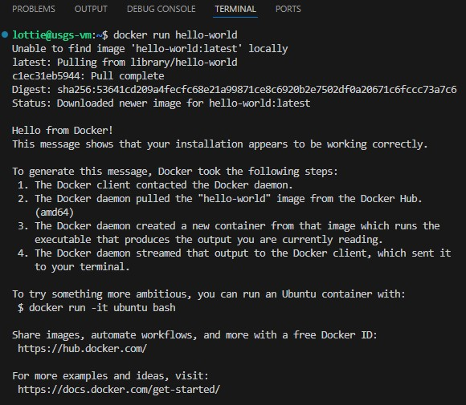

# Project Set Up

>NOTE; Do not clone this repository until you are in the home folder of your Virtual Machine, the [installation script](setup/install.sh) will do that for your! 😄

>NOTE; the project instructions for reproducibility are based on working within a Google Cloud Platform Virtual Machine environment on an [Unbuntu](https://ubuntu.com/desktop) machine. In my opinion, interacting with the GCP VM works best when using an IDE such as VS Code, where you have instant access to your files, the terminal & port forwarding, although you can use a standard terminal that allows SSH connection. If you are using anything other than the aforementioned, you may have to alter the instructions to suit your set up.  

## Project Pre-requisites

To run this project in the Cloud you will need... NOTHING! 😃 all Cloud resources are a) set up in this project b) completely free!!!

However...

To run this project locally, you will need to adjust the set up instructions and have the following installed & set up locally, I have not provided instructions for  local set up, you will need to adjust them yourself depending on your operating system:

* Google Cloud Platform Account
* Google Looker Studio Account
* Python v 3.8 >
* Google Cloud CLI SDK
* Docker
* Mage-AI v 9.0 > (includes DataBuildTools integration)
* Terraform


## Cloud Set Up


1. Follow [these instructions](setup/gcp_virtual_machine_setup.md) to create your:

    * *Google Cloud Platform Account*
    * *Google Cloud Platform Virtual Machine*
    * *Connect to your Virtual Machine from your local machine (Via SSH Connection)*

2. You should now be in your IDE or Terminal with an SSH connection to your virtual machine (instruction to do this in [VS Code here](https://code.visualstudio.com/docs/remote/ssh)) You will need the [Remote - SSH](https://marketplace.visualstudio.com/items?itemName=ms-vscode-remote.remote-ssh) extension installed if it's not already

3. If not already, `'Open a File or Folder'` in the Command Pallete `(F1)` and select the `home` folder of the virtual machine. This will display the entire contents of your virtual machine and we're ready to go!

4. Open the terminal in VS Code `(CTRL+')` and run:

    ```bash
    git clone https://github.com/LottieJaneDev/usgs_earthquake_data_pipeline.git
    ```
    Change directory into the cloned repository: 

    ```bash
    cd usgs_earthquake_data_pipeline/
    ```

5. Ensure all .sh (Shell) files in the directory executable by running: 

    ```bash
    find . -type f -name "*.sh" -exec chmod +x {} \;
    ```

6. Navigate to the [install.sh](setup/install.sh) & run it to install the following software onto your virtual machine: 

    ```bash
    cd setup/ && ./install.sh
    ```

    * *Copy your Service Account Keys to the Virtual Machine*
    * *Create your own .env file to pass your own environment variables around the project*
    * *Install Anaconda on the Virtual Machine*
    * *Install Docker on the Virtual Machine*
    * *Install Terraform on the Virtual Machine*

> To set up the environment variables required for the project, the `install.sh` will prompt you to enter specific values. Each variable corresponds to a key component of the project configuration. For instance, you will need to provide the name of the virtual machine you just created, the local file paths to the Terraform and Mage service account JSON files on your personal computer, the name of the Google Cloud Platform (GCP) project you created (e.g., 'usgs-data'), the geographical location of the GCP resources (e.g., 'US'), the GCP region and zone where the resources will be deployed (e.g., 'us-central1-c' and 'us-central1', respectively), the name of the Google Cloud Storage bucket (e.g., 'usgs-raw-data'), and the name of the BigQuery dataset (e.g., 'usgs_earthquake_data'). Once you provide these values, they will be automatically appended to a newly created .env file, ensuring seamless configuration of the project environment. The current `example.env` file can be deleted, it's only there as a reference. 

> Note; I wasn't able to `sftp` (secure file transfer protocol) from inside the VM to 'get' the service account keys into the VM - I think maybe due to my company security restrictions. I also wasn't able to use `gcloud` library with `gcloud scp` (secure copy protocol) again, due to security restrictions. I eventually had to opt for prompting the user to 'drag and drop' their Service Account Keys into the `.gcp` folder on the VM. The code & environment variables for the other options are still available but commented out. Depending on your environment & restrictions you are free to choose the most suitable option for your case. 

> You will need to either comment out / uncomment the code in the install.sh or you can ignore, the commands should fail gracefully.  Option 'LAST RESORT' (line 12-15) is currently in play (prompting you to drag and drop your files to VS Code), if you are able to do `sftp` you should use Option A (line 94 - 106) & if you want to use `gcloud scp` you should use Option B (line 108 - 110) - I hope this makes sense - Slack me if you have any issues 😄

7. Don't forget to check docker has completed installation after the install script by closing the remote connection completely & starting it back up again. This is to refresh the User Group Policies and enforce the new policy where you are an authorised user. 

> NOTE: I had to stop the virtual machine completely via the GCP UI, restart it & then reconnect via VS Code through remote SSH connection. If logging out of SSH and back in doesn't work, you may need to do this before running the below again:  

```bash
docker run hello-world
 ```

<details>
    <summary>example screenshot</summary>
    <br>
    
    </details>
    <br>

## Project Start 

1. Spin up the project resources using Terraform (Infrastructure as Code) (Iac) follow the [Terraform start guide here](terraform/README.md)

2. Spin up the Docker Container for Mage, follow the [Mage Project Start guide here](mage/README.md) this includes the DBT analytics engineering layer. 

3. Visit the Final [Project Dashboard](https://lookerstudio.google.com/reporting/b0be0518-3803-4301-9829-0125d48be9df) to visualise the earthquakes from all around the globe :earth_africa: 

## Project End 

1. Run the shutdown script [here](setup/shutdown.sh) ⚠️ IMPORTANT ⚠️ Make sure that your Terraform resources (BigQuery Datasets & Tables & Google Cloud Storage Buckets) have been destroyed by manually checking as well, just to be sure the destruction completed & to 100% avoid being charged for any provisioned resources. 

2. ⚠️ IMPORTANT ⚠️ Ensure that you turn off your billing & remove any cards you may have connected as well as deleting your virtual machine & resources mentioned above before the end of your free trial, unless you know what you are doing & have an understanding of the potential cost implications of running this or any other project in a Cloud environment. 


